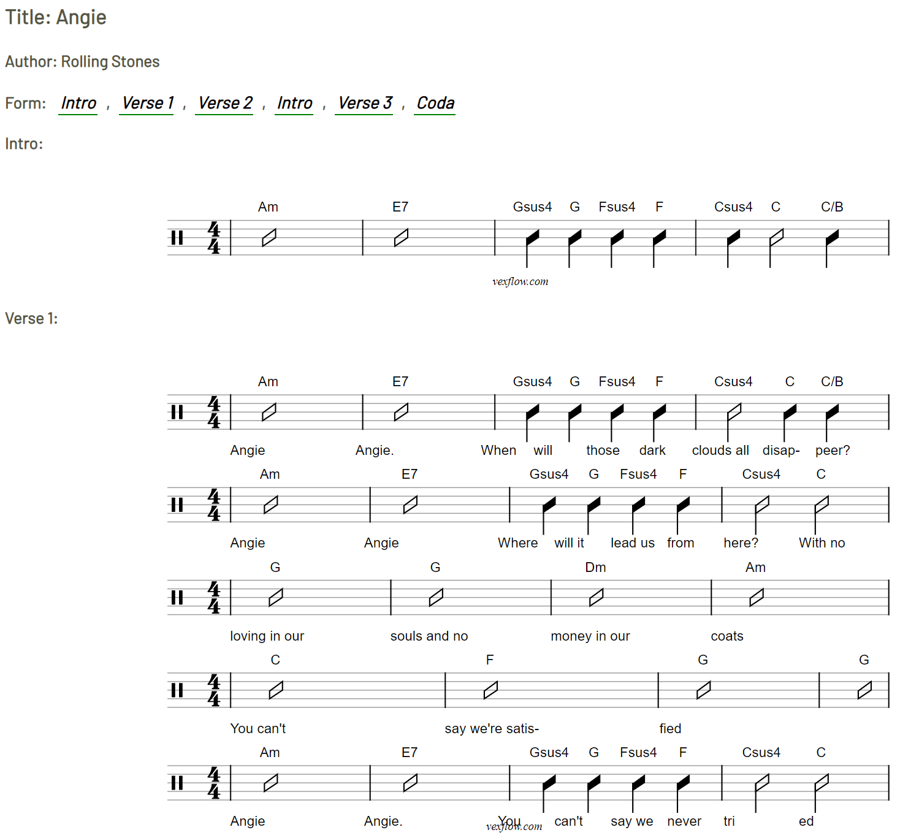

# Leadsheet - First Prototype

This package reads a text leadsheets and renders them as Vextab representations on a webpage. 

A text representation of the format (work in progress):
```
Title: Angie
Author: Rolling Stones
Form:  
  - Intro 
  - Verse 1
  - Verse 2
  - Intro
  - Verse 3
  - Coda
Key    : A Minor
Meter  : 4/4
Tempo  : 120                

Intro : 
| Am |  E7 |  Gsus4 G Fsus4 F | Csus4,4 C,2 C/B,4 |
Verse 1 :
|Am	 |E7         |  Gsus4 G Fsus4 F | Csus4,2 C,4 C/B,4
_ Angie, _ Angie._ When _will _those _dark _clouds all _disap-_peer?
|Am     |E7      | Gsus4 G Fsus4 F | Csus4 C
_Angie, _Angie  _Where _will it _lead us _from _here? _With no
|G	         |G              |Dm              |Am
_loving in our _souls and no _money in our _coats
|C	       |F	          |G   |G 
_You can't _say we're satis-_fied
|Am     |E7           |  Gsus4 G Fsus4 F        | Csus4 C
_ Angie, _ Angie. _You _can't _say we _never _tri_ed
```

produces this type of Vextab representation: 



# Demo

For a demo of this package as it is used in conjunction with 'Denoserver' HTTP server, click this Deno Deploy'ed link: https://cfjello-deno-server.deno.dev/


