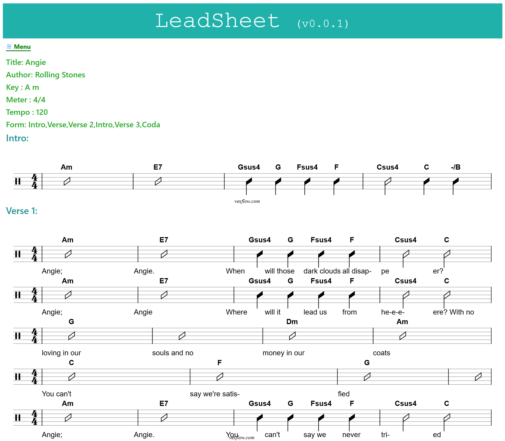

# Leadsheet - initial version, DO NOT USE YET

This package reads a text leadsheets and produces a Vextab representation on a webpage. The text representation that has the format:
```
Title: Angie
Author: Rolling Stones
Form:  
  - Intro 
  - Verse 1
  - Verse 2
  - Intro
  - Verse 3
  - Coda
Key    : A Minor
Meter  : 4/4
Tempo  : 120                

Intro : |: Am |  E7 |  Gsus4 G Fsus4 F | Csus4,4 C,2 C/B,4 :|
Verse 1 :
|Am	 |E7         |  Gsus4 G Fsus4 F | Csus4,2 C,4 C/B,4
_ Angie, _ Angie._ When _will _those _dark _clouds all _disap-_peer?
|Am     |E7      | Gsus4 G Fsus4 F | Csus4 C
_Angie, _Angie  _Where _will it _lead us _from _here? _With no
|G	         |G              |Dm              |Am
_loving in our _souls and no _money in our _coats
|C	       |F	          |G   |G 
_You can't _say we're satis-_fied
|Am     |E7           |  Gsus4 G Fsus4 F        | Csus4 C
_ Angie, _ Angie. _You _can't _say we _never _tri_ed
```

Running the package, an example is supplied in `deno run -A main.ts`, produces a Vextab representation: 



The `main.ts` program looks like this:

```
import { angie } from "./test/Angie.ts"                             // Lead Sheet
import { Parser } from "https://deno.land/x/parlexa@v1.0.3/mod.ts"  // Parser (parlexa)
import  LR  from "./lexerRules.ts"                                  // Lexer Rules
import  PR from "./parserRules.ts"                                  // Parser Rules
import align from "./align.ts"                                      // Post Processor
import Vextab from "./Vextab.ts";                                   // Vextab Renderer

const parser = new Parser( LR, PR, 'reset')                         // Instanciate parser
parser.debug = false
parser.reset(angie)                                                 // Parse input
const tree = parser.getParseTree()                                  // Get parse tree
align(tree)

const encoder = new TextEncoder();
const data = encoder.encode( JSON.stringify(tree, undefined, 2) );
Deno.writeFile( './data.json',data )

const html = new Vextab(tree)                                       // Instanciate Vextab

html.render()                                                       // Render html

const encoderHtml = new TextEncoder();
const dataHtml = encoderHtml.encode( html.getSinglePage());
Deno.writeFile( './page.html',dataHtml )
```


